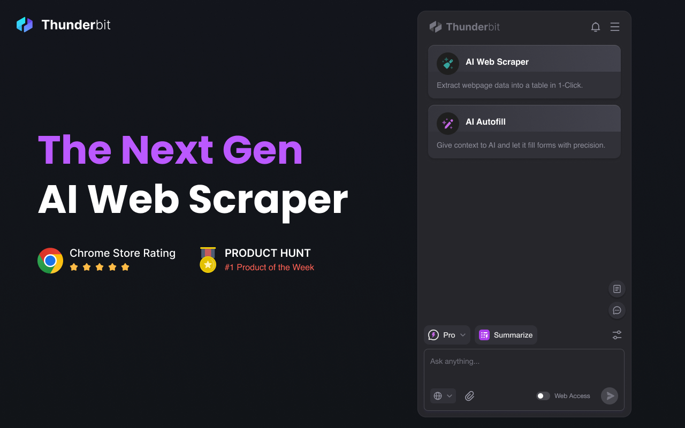
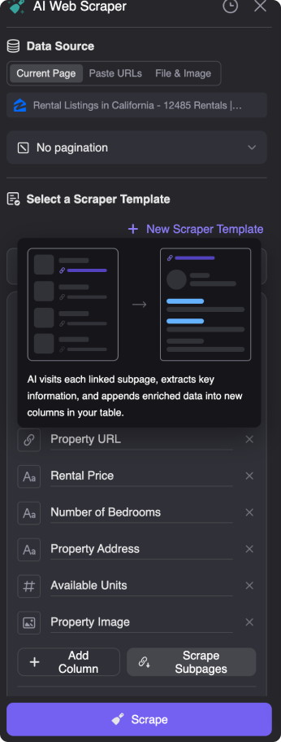
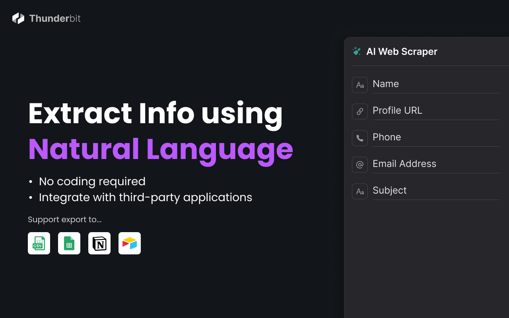

# Thunderbit AI Web Scraper

A next-gen, AI-powered web scraper that enables businesses and individuals to extract data from any website effortlessly. Perfect for lead generation, market research, and automating repetitive tasks.

Thunderbit AI Web Scraper is the easiest-to-use web scraper, powered by AI, that allows you to extract data from websites, PDFs, images, and more in just 2 clicks. No coding required!

## 🚀 Key Features

- **2-Click Scraping**: Extract data from any website with minimal effort.
- **AI-Powered Natural Language Extraction**: No need for CSS selectors—just describe the data you need.
- **Subpage Scraping**: Automatically visit linked pages and extract enriched data.
- **Multi-Source Support**:
  - 🌐 Websites
  - 📄 PDFs
  - 🖼️ Images
  - 📑 Documents
- **Pre-Built Templates**: One-click scraping for popular sites like LinkedIn, Amazon, and Google Maps.
- **Data Restructuring**: Summarize, categorize, and translate data during export.

## ⭐ Powerful Features in Action

| 📋 Table & List Extraction                                           | 📄 PDF/Image Scraping                                              |
| -------------------------------------------------------------------- | ------------------------------------------------------------------ |
|  |  |
| **🔗 Subpage Scraping**                                              | **⚙️ Data Formatting**                                             |
|  |  |

## 💼 Perfect For

- **Sales Teams**: Build targeted lead lists with enriched contact details.
- **Marketers**: Extract competitor data and market insights.
- **Researchers**: Collect large datasets for analysis.
- **Recruiters**: Scrape candidate profiles and contact information.
- **E-commerce**: Monitor product prices and reviews.
- **Real Estate**: Track property listings and agent details.
- **Operations Teams**: Automate repetitive data entry tasks.

## 🎯 Popular Use Cases

- LinkedIn Lead Generation
- Amazon Product Research
- Google Maps Business Data
- Zillow Real Estate Listings
- YouTube Channel Data
- Shopify Product Details
- Trustpilot Reviews Extraction

## 📊 Export Options

- Google Sheets
- Airtable
- Notion
- CSV
- Excel

## 🌟 Why Choose Thunderbit?

1. **No Coding Required**: Built for non-technical users.
2. **AI-Powered Efficiency**: Automates complex scraping tasks.
3. **Multi-Source Support**: Scrape websites, PDFs, images, and more.
4. **Customizable Outputs**: Get data in the exact format you need.
5. **Pre-Built Templates**: Save time with ready-to-use scrapers.
6. **Trusted by 10,000+ Users**: Rated #1 Product of the Week on Product Hunt.

## 🔗 Quick Links

- [Chrome Web Store](https://chromewebstore.google.com/detail/thunderbit-ai-web-scraper/hbkblmodhbmcakopmmfbaopfckopccgp)
- [Official Website](https://www.thunderbit.com)
- [Support Documentation](support@thunderbit.com)
- [Blog](https://www.thunderbit.com/blog)

## 🛠️ Free Tools

## 📱 Connect With Us

- [Twitter](https://twitter.com/thunderbitapp)
- [LinkedIn](https://www.linkedin.com/company/thunderbit)
- [YouTube](https://www.youtube.com/@ThunderbitAI)
- [Reddit](https://www.reddit.com/r/Thunderbit/)
- [Instagram](https://www.instagram.com/thunderbitapp/)

## ⚡ Get Started Now

Revolutionize your data collection process with Thunderbit AI Web Scraper—your ultimate tool for fast, efficient, and accurate data extraction.

## 📫 Support

Need help? Contact us at support@thunderbit.com

## 💬 What Users Say About Thunderbit

## Why Thunderbit is the Best Web Scraper for 2025

## Web Scraper Features That Save You Time

## Web Scraper Use Cases & Success Stories

## 🔄 Web Scraper Comparison

| Feature           | Thunderbit AI Web Scraper | Traditional Web Scrapers |
| ----------------- | ------------------------- | ------------------------ |
| Setup Time        | Instant                   | Hours/Days               |
| Coding Required   | No                        | Yes                      |
| Learning Curve    | Minimal                   | Steep                    |
| Automatic Updates | Yes                       | Often Manual             |
| AI-Powered        | Yes                       | Rarely                   |

---

© 2025 Thunderbit Inc. All rights reserved.
