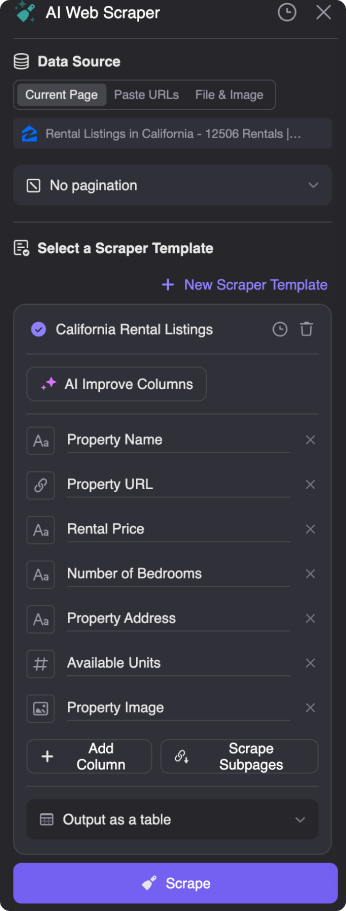
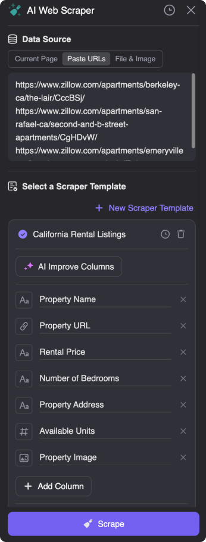
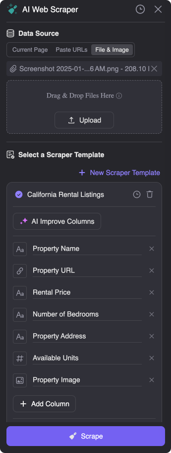

# Thunderbit AI Web Scraper

[English](README.md) | [简体中文](translations/README.zh-CN.md) | [Español](translations/README.es.md) | [日本語](translations/README.ja.md) | [한국어](translations/README.ko.md)

A next-gen, AI-powered web scraper that enables businesses and individuals to extract data from any website effortlessly. Perfect for lead generation, market research, and automating repetitive tasks.

  
  

<iframe width="560" height="315" src="https://www.youtube.com/embed/KGxafVHvD1Q?si=f66rmvbkMXWTBJJZ" title="YouTube video player" frameborder="0" allow="accelerometer; autoplay; clipboard-write; encrypted-media; gyroscope; picture-in-picture; web-share" referrerpolicy="strict-origin-when-cross-origin" allowfullscreen></iframe>

Thunderbit AI Web Scraper is the easiest-to-use web scraper, powered by AI, that allows you to extract data from websites, PDFs, images, and more in just 2 clicks. No coding required!

## 🔗 Quick Links

- [Chrome Web Store](https://chromewebstore.google.com/detail/thunderbit-ai-web-scraper/hbkblmodhbmcakopmmfbaopfckopccgp)
- [Official Website](https://thunderbit.com)
- [Blog](https://thunderbit.com/blog)
- [YouTube](https://www.youtube.com/@thunderbit-ai)

## 🚀 Key Features

- **2-Click Scraping**: Extract data from any website with minimal effort.
- **Natural Language Extraction**: No need for CSS selectors—just describe the data you need.
- **Subpage Scraping**: Automatically visit linked pages and extract enriched data.
- **Multi-Source Support**:
  - 🌐 Websites
  - 📄 PDFs
  - 🖼️ Images
  - 🎥 Videos
  - 🔗 Subpage Links
- **Pre-Built Templates**: One-click scraping for popular sites like LinkedIn, Amazon, and Google Maps.
- **Data Restructuring**: Summarize, categorize, and translate data during export.

## ⭐ Powerful Features in Action

| 📋 Web Page Scraping                                           | **🔗 Url Scraping**                                             |
| -------------------------------------------------------------------- | ------------------------------------------------------------------ |
|  |  |
| **🔗 Subpage Scraping**                                              | 📄 PDF/Image Scraping                                              |
|  |  |

## 📊 Export Options

- Google Sheets
- Airtable
- Notion
- CSV
- Clipboard

## 🔄 Web Scraper Comparison

| Feature           | AI Web Scraper | Traditional Web Scrapers |
| ----------------- | ------------------------- | ------------------------ |
| Setup Time        | Instant                   | Hours/Days               |
| Coding Required   | No                        | Yes                      |
| Learning Curve    | Minimal                   | Steep                    |
| Automatic Updates | Yes                       | Often Manual             |
| AI-Powered        | Yes                       | Rarely                   |
| Data Quality     | High                      | Variable                 |
| Speed            | Fast                      | Depends on Code          |
| Maintenance      | Zero                      | Regular Updates Needed   |
| Error Handling   | Intelligent               | Manual Configuration     |
| Multi-site Support| Universal                | Site-Specific           |
| Export Formats   | Multiple (CSV,JSON,etc.)  | Limited                 |
| Visual Interface | User-friendly             | Command-line/Basic      |

## 💼 Perfect For

- **Sales Teams**: Build targeted lead lists with enriched contact details.
- **Marketers**: Extract competitor data and market insights.
- **Researchers**: Collect large datasets for analysis.
- **Recruiters**: Scrape candidate profiles and contact information.
- **E-commerce**: Monitor product prices and reviews.
- **Real Estate**: Track property listings and agent details.
- **Operations Teams**: Automate repetitive data entry tasks.

## 🎯 Popular Use Cases

- LinkedIn Lead Generation
- Amazon Product Research
- Google Maps Business Data
- Zillow Real Estate Listings
- YouTube Channel Data
- Shopify Product Details
- Trustpilot Reviews Extraction

## ⚡ Get Started Now

## 🌟 Why Choose Thunderbit?

1. **No Coding Required**: Built for non-technical users.
2. **AI-Powered Efficiency**: Automates complex scraping tasks.
3. **Multi-Source Support**: Scrape websites, PDFs, images, and more.
4. **Customizable Outputs**: Get data in the exact format you need.
5. **Pre-Built Templates**: Save time with ready-to-use scrapers.
6. **Trusted by 10,000+ Users**: Rated #1 Product of the Week on Product Hunt.

Revolutionize your data collection process with Thunderbit AI Web Scraper—your ultimate tool for fast, efficient, and accurate data extraction.

## 💬 What Users Say About Thunderbit
> **Modestas Mankus** ⭐️⭐️⭐️⭐️⭐️  
> *Jan 12, 2025*  
> "Superb extension, works like a charm!"

---

> **Stevie Dean** ⭐️⭐️⭐️⭐️⭐️  
> *Nov 24, 2024*  
> "Works perfectly, thanks for making this!"  
> *2 out of 2 found this helpful*

---

> **Madars Bišs** ⭐️⭐️⭐️⭐️⭐️  
> *Nov 24, 2024*  
> "Thunderbit extension makes Web Scraping and Automation easier than ever! Comes with straight forward UI and beautiful looking design. 10/10 would recommend."

## 🛠️ Free Tools
## 📱 Connect With Us

- [Twitter](https://x.com/ThunderbitHQ)
- [LinkedIn](https://www.linkedin.com/company/91116307/)
- [Reddit](https://www.reddit.com/r/Thunderbit/)
- [Instagram](https://www.instagram.com/thunderbithq/)
## 📫 Support

Need help? Contact us at support@thunderbit.com

## ❓ FAQs

Why is Thunderbit the Best Web Scraper for 2025?

Discover why Thunderbit leads the web scraping industry in 2025. Read our comprehensive analysis:
[The Best Web Scraping Tools & Software in 2025](https://thunderbit.com/blog/best-web-scraping-tools)

What Features Make Thunderbit a Time-Saving Tool?

Learn about our powerful time-saving features and how they can streamline your workflow:
[How to Scrape Any Website Using AI](https://thunderbit.com/blog/scrape-any-website-using-ai)

What Are Some Real-World Applications of Thunderbit?

Explore practical use cases and success stories from our users:
[How To Scrape Amazon Products and Reviews in 2025 using AI](https://thunderbit.com/blog/how-to-scrape-amazon-products-and-reviews)

---

© 2025 Thunderbit Inc. All rights reserved.